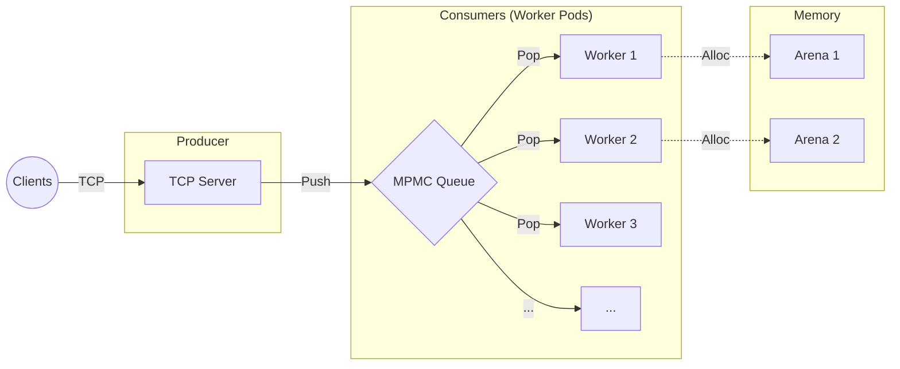

# Lumen Inference Engine

Lumen is a C++ inference engine designed to minimize software overhead in high-frequency AI workloads. The project investigates the impact of lock-free data structures and custom memory allocators on tail latency (P99) and throughput.

The engine implements a compute-bound architecture using a bounded Multi-Producer Multi-Consumer (MPMC) queue and region-based memory management (Arenas) to eliminate mutex contention and heap fragmentation.

## Performance Analysis

Benchmarks were conducted using a SqueezeNet workload on an 8-core CPU. The goal was to isolate the hardware limit (FLOPs/Memory Bandwidth) by removing synchronization bottlenecks.

### Key Metrics

| Metric | Result | Notes |
| :--- | :--- | :--- |
| **Peak Throughput** | 266 RPS | Saturated 8-core CPU capacity. |
| **Lowest P99 Latency** | 71.75 ms | Achieved with MPMC Queue + Lumen Arena. |
| **Latency Reduction** | 43% | Improvement of Arena Allocator vs. Standard Malloc. |
| **Inference Time** | 28.5 ms | Average compute time per task at full load. |

### Configuration Comparison

We tested three internal architectures to determine the optimal concurrency model:

| Architecture | Throughput | P99 Latency | Observations |
| :--- | :--- | :--- | :--- |
| **MPMC + Arena** | **266 RPS** | **71.75 ms** | **Optimal configuration.** Lowest tail latency. |
| Naive Mutex | 266 RPS | 76.29 ms | Minor jitter due to lock contention. |
| Batched Mutex | 266 RPS | 141.61 ms | High latency due to Head-of-Line blocking. |
| SPSC (Single Core) | 127 RPS | 119.12 ms | Baseline for single-thread efficiency (6.8ms inference). |

**Conclusion:** The MPMC + Arena configuration provides the most stable latency profile. The system is currently compute-bound; the 28ms inference time per task is the primary bottleneck, not the queuing logic.

## Architecture



### 1. Concurrency: Bounded MPMC Queue

Lumen utilizes a lock-free Bounded Multi-Producer Multi-Consumer queue based on Dmitry Vyukov's algorithm. This replaces the standard `std::mutex` + `std::condition_variable` approach.

* **Mechanism:** Uses atomic sequence numbers on each buffer slot to coordinate thread access.
* **Benefit:** Allows the Network Thread (Producer) and Worker Threads (Consumers) to operate without blocking, eliminating context switch overhead during high contention.

### 2. Memory: Lumen Arena

A custom region-based allocator designed to bypass `malloc`/`free` locks.

* **Mechanism:** Each worker thread maintains a local bump pointer for task memory. Allocation is O(1).
* **Benefit:** Prevents heap lock contention when multiple threads attempt to release memory simultaneously, which was identified as the cause of P99 spikes in the standard allocator tests.

### 3. Compute: Isolated Worker Pods

The engine uses a thread-per-core model. Each worker thread maintains its own inference session (simulated ONNX Runtime) to maximize L3 cache locality and prevent False Sharing between cores.

## Build and Run

### Prerequisites

* C++17 compliant compiler (GCC 9+ or Clang 10+)
* CMake 3.10 or higher

### Compilation

```bash
mkdir build && cd build
cmake -DCMAKE_BUILD_TYPE=Release ..
make -j$(nproc)

```

### Running the Engine

```bash
./lumen_engine

```

### Configuration

The engine behavior is controlled via `config.json`. You can hot-swap the internal architecture without recompiling:

```json
{
  "engine": {
    "queue_type": "mpmc",        
    "allocator_type": "lumen_arena",
    "thread_count": 8,
    "batch_size": 1
  }
}

```

* `queue_type`: "mpmc", "spsc", "naive", "batched"
* `allocator_type`: "lumen_arena", "standard"

## Visualization Dashboard

The project includes an interactive Python dashboard to visualize the benchmark CSVs, allowing you to analyze **Latency Jitter**, **Throughput**, and **Processing Stages**.

### Setup

Ensure you have Python 3 installed.

```bash
# 1. Create a virtual environment
python3 -m venv venv
source venv/bin/activate

# 2. Install dependencies
pip install -r requirements.txt

```

### Running the Dashboard

Make sure your benchmark results are in the `results/` directory, then run:

```bash
streamlit run dashboard.py

```

This will open a local web interface (usually `http://localhost:8501`) where you can compare different queue/allocator configurations side-by-side.

## Future Work

* **Networking:** Migration from `poll()` to `io_uring` to support higher connection density (C10K).
* **Hardware Acceleration:** Integration of CUDA/TensorRT execution providers to address the current compute bottleneck.
* **Quantization:** Implementation of INT8 quantization to reduce memory bandwidth pressure on the CPU.
