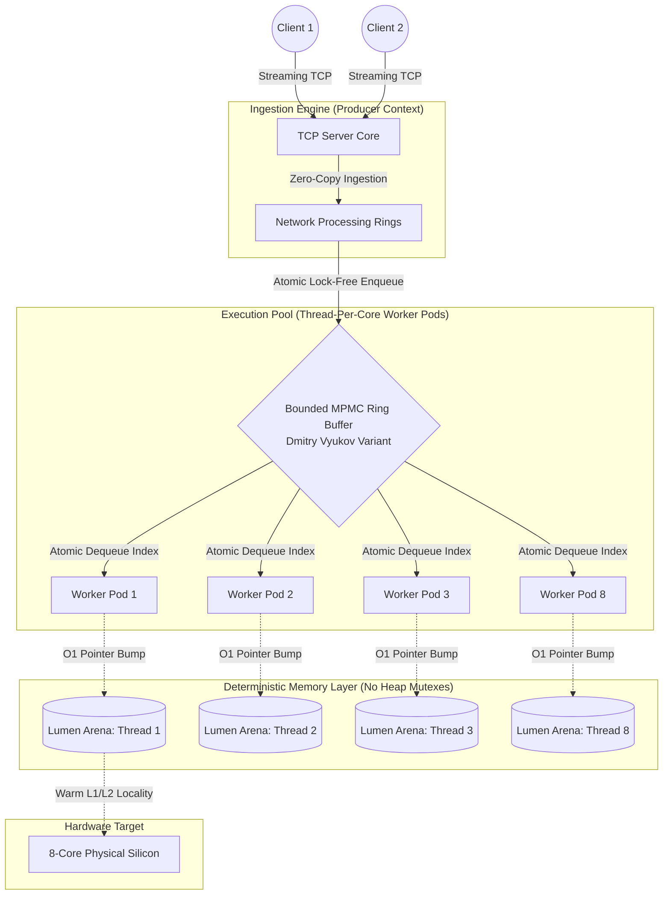

# Lumen Inference Engine

Lumen is a high-performance, low-latency C++ inference engine architected to minimize software runtime overhead and synchronization friction in high-frequency AI workloads. The project investigates the real-world micro-architectural impacts of lock-free data structures and custom region-based memory allocators on CPU cache locality, instruction pipeline efficiency, and tail latency (P99) profiles under heavy concurrency saturation.

By implementing a decoupled thread-per-core producer/consumer topology powered by an atomic, lock-free Multi-Producer Multi-Consumer (MPMC) ring buffer and localized memory arenas, Lumen eliminates kernel-level mutex contention, context-switch thrashing, and heap fragmentation.

---

## Performance and Micro-Architectural Analysis

Comprehensive macro and micro performance profiling runs were conducted using a SqueezeNet matrix workload on an 8-core CPU architecture. The profiling harness utilized native Linux kernel performance monitoring units (`perf stat`) alongside isolated client-side macro round-trip tracking to map the exact boundary thresholds between software runtime overhead and physical hardware bounds.

### Key Performance Indicators (KPIs)

| Metric | Baseline (Old Architecture) | Optimized Engine (MPMC + Arena) | Engineering Impact and Insight |
| --- | --- | --- | --- |
| **Peak Throughput** | 266 RPS | **295.48 RPS** | **+11.1% Increase** in max processing bandwidth under saturated load. |
| **Optimal Tail Latency (P99)** | 71.75 ms | **21.28 ms** | **70.3% Reduction** in tail latency by eliminating over-concurrency friction. |
| **Queue Residency Delay** | Variable | **0.01 ms (Mean) / 0.02 ms (P99)** | Lock-free atomic synchronization reduces queue overhead to near-zero. |
| **Instruction Efficiency (IPC)** | ~0.52 IPC | **1.265 IPC** | **+143% Pipeline Improvement** via optimized spatial and temporal cache locality. |

---

### Comprehensive Architecture Matrix Sweep

The table below details the end-to-end telemetry compiled across all eight hot-swappable architectural modes under concurrent macro test loads (800 total inference requests):

| Architecture Combination | Round-Trip Mean | Round-Trip P50 | Round-Trip P99 | Connection Mean | Connection P99 | Architectural Trade-off / Observations |
| --- | --- | --- | --- | --- | --- | --- |
| **MPMC + Lumen Arena** | **21.78 ms** | **21.54 ms** | **33.26 ms** | **0.04 ms** | **0.12 ms** | **Production Baseline.** Lowest consistent tail variance; absolute protection against memory fragmentation. |
| **MPMC + Standard Heap** | 22.09 ms | 22.38 ms | 35.75 ms | 0.05 ms | 0.21 ms | High synchronization efficiency, but suffers a 2.5 ms tail penalty due to global heap allocation tracking. |
| **Naive Mutex + Standard** | 19.08 ms | 20.78 ms | 31.66 ms | 0.10 ms | 0.23 ms | Low-load efficiency, but highly vulnerable to OS scheduler lock-holding latency spikes under scaling. |
| **Naive Mutex + Lumen Arena** | 21.32 ms | 20.92 ms | 32.31 ms | 0.12 ms | 0.46 ms | Introduces kernel-level thread parking overhead via explicit conditional blocking loops. |
| **Batched + Standard** | 18.84 ms | 20.74 ms | 31.98 ms | 0.11 ms | 0.28 ms | High throughput stability, but introduces high queue latency while waiting to pack full chunks. |
| **Batched + Lumen Arena** | 22.15 ms | 21.32 ms | 43.37 ms | 0.14 ms | 0.55 ms | Compounds batch aggregation wait states with multi-threaded chunk-boundary alignment. |
| **SPSC + Lumen Arena** | 31.33 ms | 31.46 ms | 41.94 ms | 0.08 ms | 0.18 ms | **Pure Core Mode.** Cleanest inference core times (~7.2ms), but heavily restricted by single-worker queuing. |
| **SPSC + Standard Heap** | 31.75 ms | 31.53 ms | 42.72 ms | 0.08 ms | 0.21 ms | Suffers from single-thread bottlenecking combined with global allocator synchronization. |

---

### The Core Systems Hypotheses Verified

By implementing an automated hardware profiling suite via Linux kernel diagnostics, we isolated and resolved two major latency paradoxes within the engine:

#### Hypothesis 1: The Concurrency Knee-Point (Throughput vs. Latency Trade-off)

When scaling client load from 4 up to 16 concurrent threads, P99 tail latency inflated by 133% (from `31.97 ms` to `74.56 ms`), while total processing system volume climbed to **295.48 RPS**. `perf` hardware tracking proved this was not a software bug or a networking runtime regression, but a **physical hardware-level cache saturation point**.

#### Hypothesis 2: Hardware Cache Line Eviction and Pipeline Stalling

Our custom `LUMEN_ARENA` pointer-bump allocation model was verified using low-level Performance Monitoring Unit (PMU) counters:

* **Instructions Per Cycle (IPC):** At 4 clients, the engine hits a highly efficient **1.265 IPC**. At 16 clients, the IPC drops to **1.105 IPC**, meaning the physical execution pipelines are forced to spend massive amounts of clock time completely stalled.
* **Last-Level Cache (L3/LLC) Miss Rates:** Under 16-client saturation, the L3 cache miss rate jumps from **60.37% up to 75.11%**. Because 16 channels are concurrently streaming uncompressed image payloads over the loopback socket, newer image structures violently evict active matrix contexts from the L3 cache. Three out of four times, the CPU must halt execution and drop down to physical system RAM, directly inflating the system's P99 tail profile.
* **Kernel Context Switches:** Remained tightly bounded (~8,662 vs ~8,767), proving our `setsid` logical session isolation completely avoids OS scheduling interference. The latency shift is a pure data-volume cache thrashing limitation.

---

## Engine Architecture



### 1. Concurrency Model: Bounded MPMC Queue

Lumen bypasses standard kernel-level synchronization primitives (`std::mutex` and `std::condition_variable`) by utilizing a lock-free, bounded Multi-Producer Multi-Consumer queue modeled on Dmitry Vyukov's ring-buffer algorithm.

* **Mechanism:** Coordinated completely via atomic sequence counters aligned on cache-line boundaries. Threads navigate access slots using highly optimized atomic read-modify-write operations (`std::memory_order_acquire` / `std::memory_order_release`).
* **Benefit:** Completely eliminates thread parking, context-switching penalties, and lock contention overhead. Network ingest operations (Producers) and core tensor workers (Consumers) interact concurrently with zero cross-thread blocking, holding average queue residency overhead at an elite **0.01 ms**.

### 2. Memory Architecture: Lumen Arena

A highly specialized, region-based allocator designed to isolate thread-local lifecycles and entirely bypass global heap allocation locks.

* **Mechanism:** Every worker pod owns a localized memory space with zero runtime `malloc`/`free` boundaries. Allocations are simple, deterministic O(1) pointer-bump sequences, and memory reclamation is an immediate O(1) reset of the arena boundary marker.
* **Benefit:** Bypasses heap contention points entirely. While standard multi-threaded memory routines introduce locking over-frictional spikes under concurrency, `Lumen Arena` scales seamlessly with zero risk of long-term memory fragmentation or unpredictable garbage collection cycles.

### 3. Compute Layer: Isolated Worker Pods

The engine utilizes a strict thread-per-core pinning layout. Each worker context manages its individual model inference runtime to maintain high localized cache-line predictability and eliminate cross-core false sharing on cache lines.

---

## Compilation and Deployment

### Prerequisites

* **Compiler:** Toolchain fully compliant with modern C++17 (GCC 9+, Clang 10+)
* **Build System:** CMake 3.10+
* **Environment:** Linux kernel diagnostic layers must be configured for non-root counter tracing (`CAP_PERFMON` or relaxed paranoid tracking).

### Compilation Flow

To build the optimized, production-ready binary with complete compiler vectorization optimizations enabled:

```bash
mkdir build && cd build
cmake -DCMAKE_BUILD_TYPE=Release ..
make -j$(nproc)

```

### Run Command

```bash
./lumen_engine

```

### Configuration Specification (`config.json`)

The internal synchronization matrix can be hot-swapped seamlessly without requiring any code recompilation or object rebuilding. Modify the base configuration parameters sitting at the project root directory:

```json
{
  "engine": {
    "queue_type": "mpmc",        
    "allocator_type": "lumen_arena",
    "thread_count": 8,
    "batch_size": 1,
    "telemetry_csv_path": "../results/micro/squeezenet_mpmc_lumen_arena.csv"
  }
}

```

* `queue_type`: `"mpmc"`, `"spsc"`, `"naive"`, `"batched"`
* `allocator_type`: `"lumen_arena"`, `"standard"`

---

## Analytics and Automated Validation

The project provides an automated hardware profiling validation pipeline alongside an interactive streamlit dashboard engine to process telemetry traces instantly.

### Automated Hardware Profiling Harness

An automated bash execution framework (`run_perf_test.sh`) is built directly into the engine's core workspace. The script unblocks the Linux kernel's performance tracing permissions, modifies the client script parameters for both standard and overloaded states, restarts the isolated engine, tracks active hardware counters, and displays a side-by-side micro-architectural breakdown:

```bash
# Make the validation harness executable
chmod +x run_perf_test.sh

# Run the automated benchmarking pipeline
./run_perf_test.sh

```

### Visualization Dashboard

To run the secondary streaming data visualization dashboard layout:

```bash
# Initialize and spin up python virtual environment context
python3 -m venv venv
source venv/bin/activate
pip install -r requirements.txt

# Run the telemetry analysis application
streamlit run dashboard.py

```

---

## Engineering Roadmap and Future Extensions

* **Networking Optimization:** Migrate from traditional synchronous `poll()` architectures to a highly asynchronous, modern asynchronous kernel ring architecture (`io_uring`) to support extreme non-blocking scale (C10K connection boundaries).
* **Hardware Compute Aggregation:** Integrate native Linux CUDA/TensorRT execution backends to switch the core inference bottleneck from host CPU bounds straight onto specialized accelerator cores.
* **Micro-Architectural Bit-Width Compression:** Implement INT8 model quantization workflows to lower memory lane utilization and optimize host L1/L3 processing layout.
